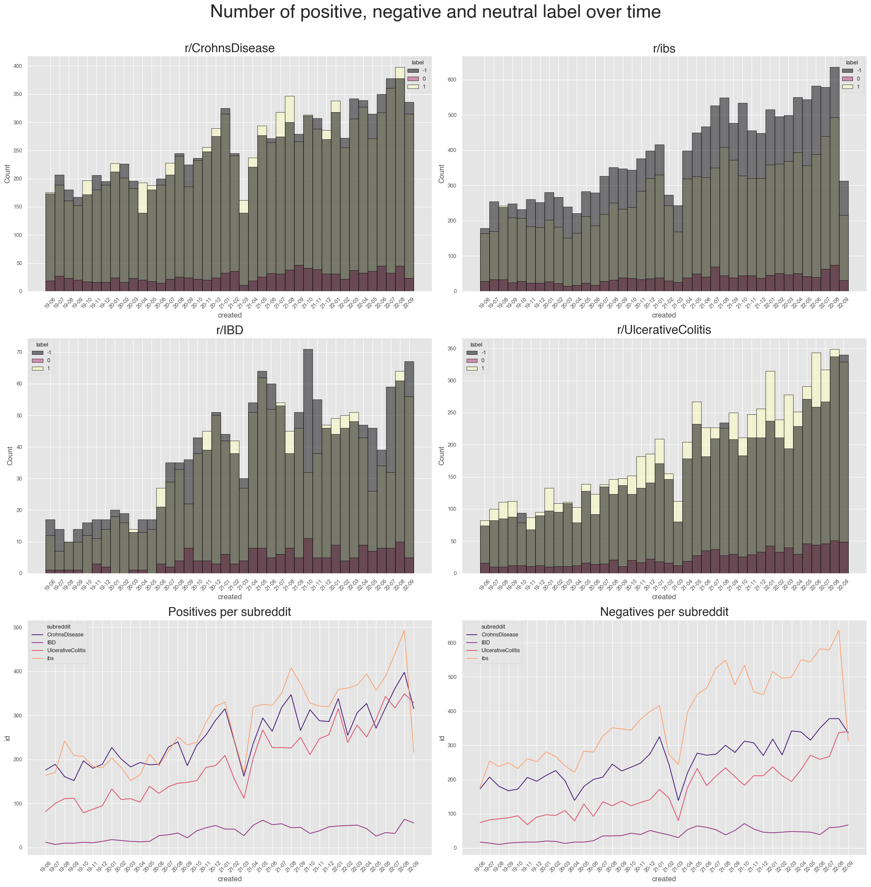

# Autoimmune gastrointestinal diseases and irritable bowel syndrome, an infodemiological comparison before and during covid 19
  

## About the project 

This repository represents the work for my university thesis, "Autoimmune gastrointestinal diseases and irritable bowel syndrome, an infodemiological comparison before and during covid 19".

The goal of the project is to discover if there is any correlation between the sentiment in subreddits about Crohn's Disease and COVID-19. My work follows a previous one made by my thesis relator and another researcher.

Submissions and Comments have been scraped from the subreddits above, and the period of the research is between June 2019 and September 2022.

To perform Sentiment Analysis **roBERTa** and **Vader** have been used. 

## Results

Data from the four different subreddits have been analyzed to how they changed over time and how changed the **sentiment** they brought.

The analysis focused on:

- How the **number** of monthly contributions (comments and submissions) changed, comparing data before and after covid19 spread
- How the **sentiment** of the contributions changed, comparing data before and after covid19 spread
- How the **two different types of diseases** (ibd and ibs) changed after covid19 spread

The study carried out was able to state that the **number** of contributions has changed significantly as well as the average **sentiment** worsened over time. On the other hand, it could not be said that the **two types of diseases** varied differently from each other.

To state that, statistical test were used, in order to scientifically confirm the analysis. In particular the Kolmogorov Smirnov test were used.

## Some highligts

## Further info

### Where are the data

It's a choice to don't publish data because the size of the csv files it's too large for git. Also the scraping scripts are not public because they would be useless without the reddit client id and secret to scrape.

### Reddit Api

In order to acces reddit apis is mandatory to register the script you are using at on [reddit apps](https://reddit.com/prefs/apps).
Registering you'll obtain the infos to access the api.
